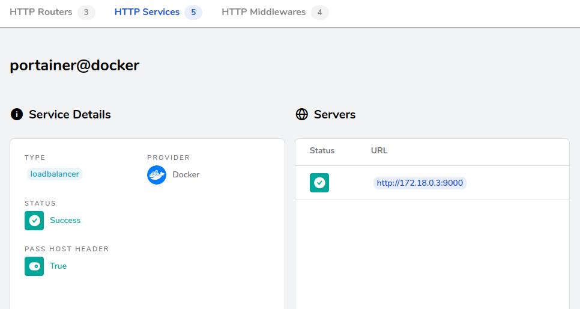

# 2023116 Keycloak
Ported the existing docker-compose file for keycoak (which was already a stack as it has two containers; postgres and keycloak). Had to add an new network which is internal to the keycloak stack which both containers are on to allow server<->datbase communications. The keycloak server is then also on the external ```web``` network with traefik and portainer.

# 20231115 Portainer
Managed to deploy Portainer as a service using ansible and docker-compose. It has a letsencrypt certificate.
I did not need to expose ports 8000 or 9443. I think it is exposing HTTP on port 9000, and traefik is proxying through HTTPS 443 to that.


# 20231108 Traefik
Working! In the traefik config in the docker-compose file, we set 

```
command
  --certificateresolvers.letsencrypt.acme.dnschallenge=true
  --certificateresolvers.letsencrypt.acme.dnschallenge.provider=cloudflare
labels:
  "traefik.http.routers.traefik.tls.certresolver=letsencrypt
environment:
  "CLOUDLFARE_DNS_API_TOKEN=${cloudflare_api_token}"
```
where cloudflare_api_token is defined in the .env file.

# 20231106 Traefik
I think I've been getting muddled up and started using cloudflare directly as a certificate provider. This is not what I want. I want to use letsencrypt, but with a cloudflare plugin to manage the setting up of DNS verification records.

Co back to Predrag's udemy course and reset traefik's docker config to use letsencrypt, and then work out how to specify using a DNS challenge and the plugin.

# 20231101 Traefik
Not really a Traefik issue but docker seems to rely on the same openssl issues that I fixed by using a venv for certbot. I have possibly broken my python installation while trying to fix certbot previously.

This was because I'd tried to install pip3 from python itself. Fixed by installing the raspbian package maintainer copy ```sudo apt install python3-pip```.

# 20231011 Certbot
Create a venv under /opt/certbot using ansible.
Installed certbot and certbot-dns-cloudflare using pip module of ansible.
Made the domain gwl.org.uk for certbot, not using the sun sub-domain. I hope that I can create machines under the sub-domain and wildcard certificates will just work.
Added --work-dir and --config-dir paramters to certbot so everything resides under /opt/certbot and is onwed by certbot user.
Had to make /var/log/letsencrypt owned by certbot user
# 20231008 Certbot
There are bigger issues with Certbot. ```apt``` only has a very old version (0.31.0) but the pip3 install of ```certbot-dns-cloudflare``` requires something like ```>=2.3.0```. Installing the cloudflare plugin from apt also didn't work.
Trying to install certbot via pip3 (which would get me 2.5.0) also fails because *it needs a rust compiler!* Apparently the cryptoography componenent which has this should have a precompiled "wheel" but seems not to on the Pi. I then have an additional problem that installation via pip3 isn't creating a callable binary in ```/usr/bin``` or ```/usr/local/bin```.
Currently apt shows certbot is not installed.
```bash
> pip3 list
cloudflare       2.12.4
cryptography     2.6.1
```
Installing certbot-dns-cloudflare should resolve dependencies but gets the rust complaint.
```bash
> pip3 install certbot-dns-cloudflare
```
Great :/ This seemed to work but there were errors and now crypto has a runtime error
```AttributeError: module 'lib' has no attribute 'X509_V_FLAG_CB_ISSUER_CHECK'```.
Check if pip3 needs to be/can be updated. Feels like a version mismatch thing.

After messing around, I think the correct solution is to run everything in a venv - I've created a test one where pip works, even though I've goosed the main global version - due to crypto.py being corrupted. This can possibly be fixed through reinstalling apt copies of python3-pip and python3-cryptography.
```bash
> apt-get --reinstall install python3-cryptography
```
seems to have fixed my pip3 installation! Phew.

But seriously, use a venv for setting up certbot.


# 20230930 Certbot
Fixed misreferenced hosts entry for xander.int.gwl.org.uk (shoud be sun).
# 20230930 Hostname
Added xander to /etc/hosts and hostname. Using sun.gwl.org.uk to indicate the internal sunnydale network with internal IPs.
# 20230929 Setup
Got a basic setup working. I created a vault_vars.yml files using
```bash
> EDITOR=vim ansible-vault create vault_vars.yml
```
I load the defined var (ansible_become_password) using vars_files clause in ```setup.yml```.
I add ```ansible_become_pass='{{ ansible_become_password }}'``` to the hosts entry for xander. This allows ```become: true``` to work correctly.

I'm now adding docker and while it seems to work, I have lost the entries from the existing Plex homescreen. Not sure how/why. *Addendum: This is back and working the next morning with no fix applied.*

*Installing docker-ce may require a docker.list file in ```/etc/apt/sources.list.d/```. This was present on xander but may have been added manually by me previously.*