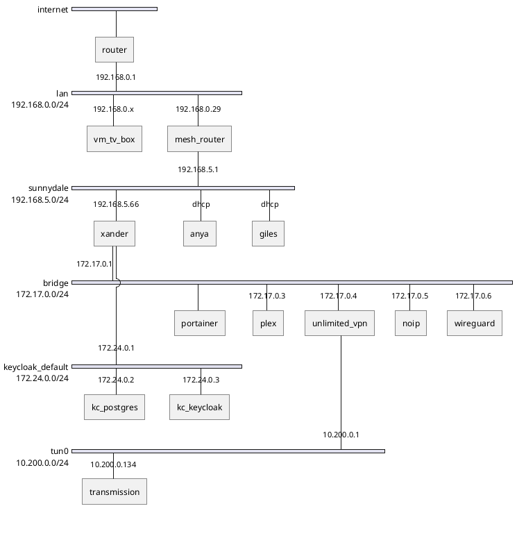
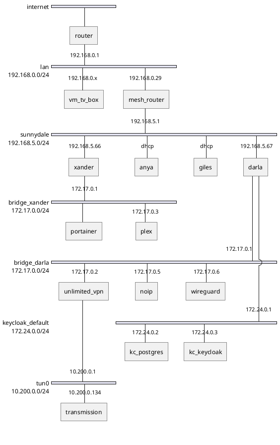

# Sunnydale

Really, I think I just need to keep xander as is, and move my home directory/docs/pics to a new server? And if I'm going to do that, I may as well just use the laptop, and backup to a NAS?

## Current

## Target

